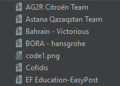
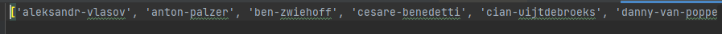

# Documentation: Rider Scraper

### Language: Python
### Time Spent(Start to Finish): <2hr
<hr>

## Why Make This?

There is a limitation with the [ProCyclingStats](https://www.procyclingstats.com/) that limits my ability to grab all Riders currently at a world tour level. The api currently when searching for *All Riders* via: 

```python
import requests

url = "https://pro-cycling-stats.p.rapidapi.com/riders"

headers = {
	"X-RapidAPI-Key": "myKey",
	"X-RapidAPI-Host": "apiHost"
}

response = requests.request("GET", url, headers=headers)

print(response.text)
```
Returns only the top 100 riders by points. The objective of the project is to visualize the weight and height of the riders in order to better understand how this correlates to performance. A subset of only 100 riders is not sufficient for data visualization and due to the fact that it contains only the top riders currently does not allow for comparison of the worst performing and best performing riders.

### Solving The Above Issue

I have been unsuccessful in navigating the issue with a all /riders call, and adding an offset and top parameter seems to have no effect on the call. The api however does allow via: 

```python
url = "https://pro-cycling-stats.p.rapidapi.com/riders/julian-alaphilippe"
```
 In which the ending of the url string is a riders name identifier used by the website to provide a page filled with the riders information. This information with the name identifier can be called for and received by the api. Returning all required information about the rider.
 
These strings are also included on the Team page that lists all riders; 

```html
<a href="rider/benoit-cosnefroy">COSNEFROY Benoît</a>
<a href="rider/ben-o-connor">O'CONNOR Ben</a>
```
They should be extractable via a webscraper and as such the design of this project began. 

## How Rider Scraper Was Made:

### Step 1:
#### Gather Team Links Via The Website

```text
https://www.procyclingstats.com/team/ag2r-citroen-team-2022
https://www.procyclingstats.com/team/astana-qazaqstan-team-2022
https://www.procyclingstats.com/team/bahrain-victorious-2022
https://www.procyclingstats.com/team/bora-hansgrohe-2022
https://www.procyclingstats.com/team/cofidis-2022
https://www.procyclingstats.com/team/ef-education-easypost-2022
https://www.procyclingstats.com/team/groupama-fdj-2022
https://www.procyclingstats.com/team/ineos-grenadiers-2022
https://www.procyclingstats.com/team/intermarche-wanty-gobert-materiaux-2022
https://www.procyclingstats.com/team/israel-premier-tech-2022
https://www.procyclingstats.com/team/team-jumbo-visma-2022
https://www.procyclingstats.com/team/lotto-soudal-2022
https://www.procyclingstats.com/team/movistar-team-2022
https://www.procyclingstats.com/team/quick-step-alpha-vinyl-2022
https://www.procyclingstats.com/team/team-bikeexchange-jayco-2022
https://www.procyclingstats.com/team/team-dsm-2022
https://www.procyclingstats.com/team/trek-segafredo-2022
https://www.procyclingstats.com/team/uae-team-emirates-2022
```

### Step 2:
#### Determine methodology of extraction (Scraper).

[Beautiful Soup](https://www.crummy.com/software/BeautifulSoup/bs4/doc/) or [Selenium](https://www.selenium.dev/).

#### Why Beautiful Soup?

I chose beautiful soup for this project because it needed to be done fast. Beautiful soup is a very user friendly scraping library that is valuable if you are parsing HTML data. While Selenium is better if the website returns JS, since it fetches all resources.

### Step 3: 
#### Programming the project
Imports
```python
import requests
import re
from bs4 import BeautifulSoup
```
[**requests**](https://requests.readthedocs.io/en/latest/): Allows for the sending of HTTP requests without manually adding query strings. 

[**re**](https://docs.python.org/3/library/re.html): Provides the reuglar expression matching used to match the href tag since the HTML of ProCyclingStats is not formatted in a way in which the riders have identifiable tags. 

[**bs4** from **BeautifulSoup**](https://www.crummy.com/software/BeautifulSoup/bs4/doc/): Provides the ability to pull data from the HTML file provided by the HTTP request. *(Also works on XML files)*


```python
teamUrls = [...]

URL = teamUrls[0]
page = requests.get(URL)
```

First I declared a list of team URLs which was made up of the STEP 1 gather links, URLS.

I then set a URL variable equal to a specified index of that List and used that URL to make my get request.

**Why didn't you iterate the list?** 

I chose not to iterate the list because I'm quite inexperienced with this entire process and wanted to make sure that I could manually validate the recieved information as well as parse each team into its own TXT file containing a Dictionary version of the data, which you'll see below. 

```python
bSoup = BeautifulSoup(page.content, "html.parser")
riders = bSoup.find_all('a', href=re.compile("rider/"))
extracted_riders = []
```
I set the recieved object, which is a Python object parsed from the HTML. Afterwards I set a riders variable equal to a find all of all href's that included the keyword "rider/" (As mentioned before the hrefs were not named in a way that allowed for them to be searched in another way). Lastly I created an extracted_list to be used later to store these values.  

```python
i = 0
while i < len(riders):
    print(riders[i].get('href').replace("rider/", ""))
    extracted_riders.append(riders[i].get('href').replace("rider/", ""))
    i = i+1
rider_dictionary = list(dict.fromkeys(sorted(extracted_riders)))
```

Another small roadblock I ran into was that the HTML page returned many results that included rider, and many duplicated versions of certain riders. This is because the page also includes lists of best performing riders, staff, latest victories and top results. 

This was quickly remedied, instead of using 

```python
for rider in riders: 
```

I instead iterated over the Python object via its length. I appended the received results minus the "rider/" prefix to the extracted_riders list. This is because the api used to search individual riders is called via riders/RIDERNAME not rider.  

All that was left was writing the list to a dictionary and then writing the dictionary to a text file for use later when I create the project that calls the api. Heres the results of that work.




